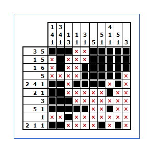

# Nonogram backend

**This project implements nonogram backend logic.**

## Will be implemented:

- ### First sprint:
  - [ ] Project structure;
  - [x] Error handler;
  - [x] Logging system;
  - [ ] User login and logout;
  - [ ] User registration;
  - [ ] Sessions (registered and anonymous users).
